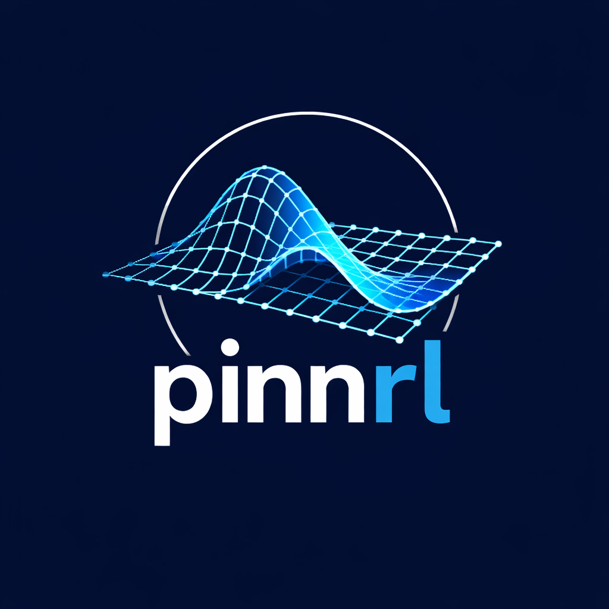

<p align="center">
  
</p>

# pinnrl &mdash; PINNs + RL for PDEs

[](https://opensource.org/licenses/MIT)
[](https://www.python.org/downloads/)
[](https://github.com/josegarciav/PINNs-RL-PDE)
[](https://github.com/josegarciav/PINNs-RL-PDE/actions/workflows/checks.yml)
[](https://codecov.io/gh/josegarciav/PINNs-RL-PDE)

**Solve PDEs with neural networks that learn where to look.**

`pinnrl` combines Physics-Informed Neural Networks (PINNs) with Deep Q-Network reinforcement learning to place collocation points adaptively — concentrating compute where the residual is highest, not where a grid happens to land. Integrate your chosen architecture, your custom equations, a Dashboard trainer, and add exact/quasi-exact analytical solutions for validation.

---

## Why pinnrl?

Traditional PDE solvers (FEM, FDM) require meshes that become expensive in high dimensions or on irregular geometries. PINNs offer a mesh-free alternative, but their accuracy depends critically on *where* training points are sampled. Random or uniform sampling wastes capacity on easy regions while undersampling shocks, steep gradients, and phase boundaries.

`pinnrl` treats collocation point placement as a sequential decision problem. A DQN agent observes the current residual field and selects sampling regions to maximize physics compliance. The result is faster convergence and better accuracy on problems that defeat uniform sampling — Burgers shocks, KdV solitons, Cahn-Hilliard interfaces.

**Real use cases this targets:**

- **Fluid dynamics** — advection-dominated flows, shock formation (Burgers, Convection)
- **Materials science** — phase-field modeling, spinodal decomposition (Allen-Cahn, Cahn-Hilliard)
- **Quantitative finance** — option pricing on non-standard payoffs (Black-Scholes)
- **Nonlinear wave propagation** — soliton dynamics (KdV), resonance (Wave, Pendulum)

---

## Supported PDEs

| PDE | Domain | Key Parameters | Recommended Architecture |
|-----|--------|----------------|--------------------------|
| Heat | `[0,1] x [0,T]` | thermal diffusivity `alpha` | Fourier Features |
| Wave | `[0,1] x [0,T]` | wave speed `c` | SIREN |
| Burgers | `[-1,1] x [0,T]` | viscosity `nu` | Fourier Features |
| KdV | `[-pi,pi] x [0,T]` | dispersion `delta` | ResNet |
| Convection | `[0,1] x [0,T]` | advection velocity `beta` | Fourier Features |
| Allen-Cahn | `[-1,1] x [0,T]` | interface width `epsilon` | ResNet |
| Cahn-Hilliard | `[0,1]^2 x [0,T]` | mobility `M`, interface `epsilon` | Self-Attention |
| Black-Scholes | `[S_min,S_max] x [0,T]` | volatility `sigma`, rate `r` | FeedForward |
| Pendulum | `[0,2pi] x [0,T]` | damping `gamma`, forcing `F` | SIREN |

---

## Supported Architectures

| Architecture | Best For | Key Hyperparameters |
|---|---|---|
| `feedforward` | Smooth, low-frequency solutions | `hidden_dim`, `num_layers`, `activation` |
| `resnet` | Deep networks, stiff equations | `num_blocks`, `hidden_dim` |
| `siren` | Oscillatory, wave-type problems | `omega_0` (frequency scale) |
| `fourier` | High-frequency, spectral accuracy | `mapping_size`, `scale` |
| `fno` | Operator learning, multi-scale PDEs | `modes` (frequency cutoff), `num_blocks` |
| `attention` | Multi-scale, complex geometry | `num_heads`, `num_blocks` |
| `autoencoder` | Latent-space compression tasks | `latent_dim`, `hidden_dim` |

---

## Quick Start

### Installation

```bash
# Recommended (uv)
uv add pinnrl

# pip
pip install pinnrl
```

Available PDE keys: `heat`, `wave`, `burgers`, `kdv`, `convection`, `allen_cahn`, `cahn_hilliard`, `black_scholes`, `pendulum`.

### Python API — solving the heat equation

```python
import torch
from src.config import Config, ModelConfig, TrainingConfig, EarlyStoppingConfig
from src.neural_networks import PINNModel
from src.pdes.heat_equation import HeatEquation
from src.pdes.pde_base import PDEConfig
from src.training.trainer import PDETrainer

device = torch.device("cpu")

training = TrainingConfig(
    num_epochs=3000, batch_size=2048,
    num_collocation_points=5000, num_boundary_points=500, num_initial_points=500,
    learning_rate=1e-3, weight_decay=1e-4, gradient_clipping=1.0,
    early_stopping=EarlyStoppingConfig(enabled=True, patience=100, min_delta=1e-7),
    learning_rate_scheduler=None,
)
pde_config = PDEConfig(
    name="heat", domain=[[0.0, 1.0]], time_domain=[0.0, 1.0],
    parameters={"alpha": 0.01},
    boundary_conditions={"type": "dirichlet"},
    initial_condition={"type": "sine", "amplitude": 1.0, "frequency": 2.0},
    exact_solution={"type": "sin_exp_decay", "amplitude": 1.0, "frequency": 2.0},
    dimension=1, device=device, training=training,
)
config = Config.__new__(Config)
config.device = device
config.model = ModelConfig(input_dim=2, hidden_dim=128, output_dim=1,
                           num_layers=4, activation="tanh", architecture="fourier")
config.training = training
config.pde_config = pde_config

pde     = HeatEquation(config=pde_config)
model   = PINNModel(config=config, device=device)
trainer = PDETrainer(model=model, pde=pde,
                     optimizer_config={"learning_rate": 1e-3, "weight_decay": 1e-4},
                     config=config, device=device)
trainer.train(num_epochs=3000)

# Validate against exact solution u(x,t) = A * exp(-alpha*(2pi*f/L)^2 * t) * sin(2pi*f*x/L)
metrics = pde.validate(model, num_points=5000)
print(f"L2 error: {metrics['l2_error']:.2e}  |  Max error: {metrics['max_error']:.2e}")
```


---

## Features

- **RL-adaptive collocation** — a DQN agent (`src/rl/rl_agent.py`) observes the current residual field and steers point sampling toward high-error regions, reducing wasted forward passes on low-residual areas.
- **Seven neural architectures** — FeedForward, ResNet, SIREN (periodic activations), Fourier Features (random Fourier mapping), Fourier Neural Operator (spectral convolutions), Self-Attention Transformer, and Autoencoder, all exposed through a single `PINNModel` factory class.
- **Nine PDEs** — linear to nonlinear, parabolic to hyperbolic, 1D to 2D, spanning thermal diffusion, soliton dynamics, phase-field models, and financial derivatives.
- **Exact analytical solutions** — every PDE ships with an `exact_solution` method for L2 and max-error validation during and after training; no external reference solver is required.
- **Adaptive loss weighting** — residual-balancing weights (RBW) and learning-rate-based weights (LRW) automatically re-balance physics, boundary, and initial condition loss terms.
- **Dash dashboard** — configure and launch experiments, monitor convergence metrics, and compare runs without writing plotting code.
- **Hardware-aware** — automatically selects CUDA, Apple MPS, or CPU; configurable via the `--device` flag or `config.yaml`.

---

## Comparison with Related Libraries

| Feature | pinnrl | DeepXDE | NeuralPDE.jl |
|---|---|---|---|
| RL-based adaptive sampling | Yes | No | No |
| Architectures bundled | 7 | 3 | 2 |
| Dashboard trainer | Yes | No | No |
| Exact solutions built in | Yes | Partial | Partial |
| Language | Python | Python | Julia |
| Install | `pip install pinnrl` | `pip install deepxde` | Julia pkg manager |

---

## Roadmap

| Version | Status | Milestones |
|---|---|---|
| v0.1 | Now | 9 PDEs, 7 architectures, DQN adaptive sampling, Dash dashboard, exact-solution validation |
| v0.2 | Planned | PyPI release, 2D/3D geometry, PPO agent option, YAML config schema validation |
| v0.3 | Planned | Operator learning (DeepONet-style), uncertainty quantification, JAX backend |
| v1.0 | Future | Stable public API, community PDE registry, full documentation site |

---

## Who Is It For?

- **PhD students and researchers** prototyping mesh-free PDE solvers without implementing adaptive sampling from scratch.
- **Computational scientists** in fluid dynamics, materials science, or plasma physics benchmarking PINNs against FDM/FEM on standard problems.
- **Quantitative analysts** exploring neural PDE solvers for high-dimensional option pricing beyond Black-Scholes closed forms.
- **ML engineers** studying how RL exploration strategies transfer to scientific computing.

---

## Contributing

Contributions are welcome. Please open an issue before submitting a large pull request.

**Core development:** Jose Garcia Ventura ([@josegarciav](https://github.com/josegarciav))

**Community contributions** in scope: new PDEs, new architectures, bug fixes, documentation improvements, and example notebooks. See [CONTRIBUTING.md](CONTRIBUTING.md) for the full guide.

---

## Citation

If you use `pinnrl` in published work, please cite:

```bibtex
@software{garcia2024pinnrl,
  author    = {Garcia Ventura, Jose},
  title     = {pinnrl: Physics-Informed Neural Networks with Reinforcement Learning Adaptive Sampling},
  year      = {2024},
  url       = {https://github.com/josegarciav/PINNs-RL-PDE},
  note      = {Open-source Python library for mesh-free PDE solving}
}
```

---

## License

[MIT License](LICENSE) &copy; 2024 Jose Garcia Ventura
