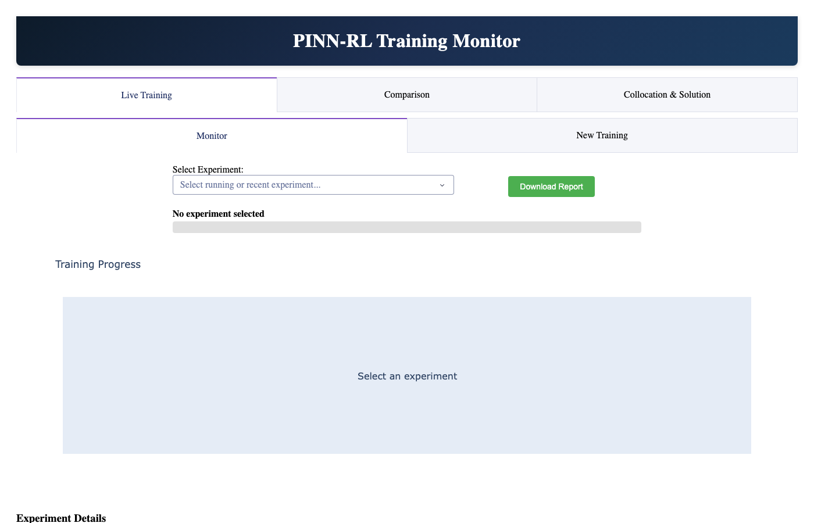
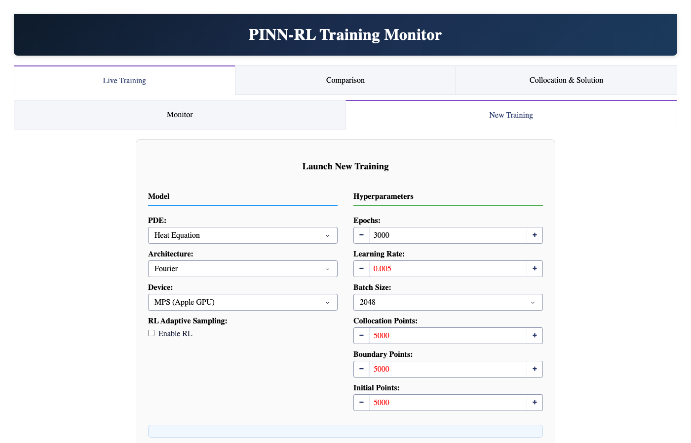
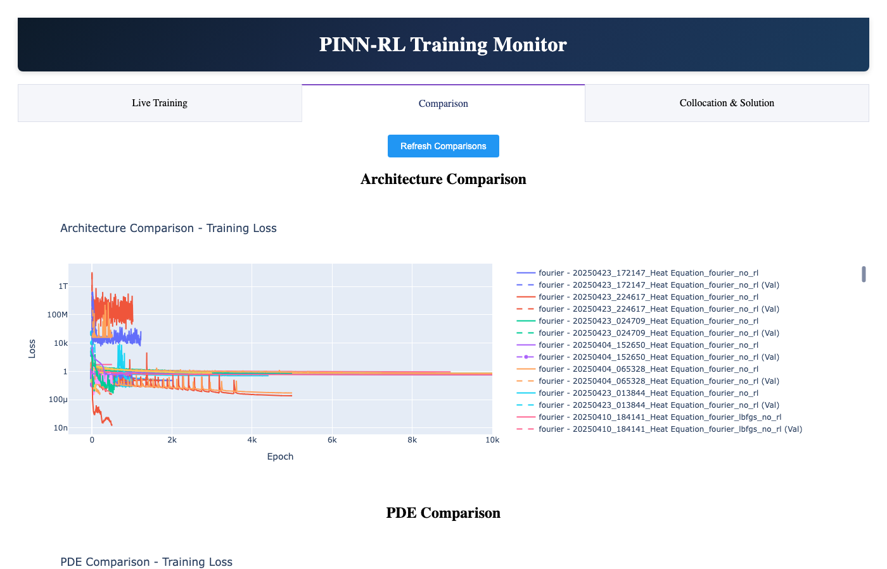
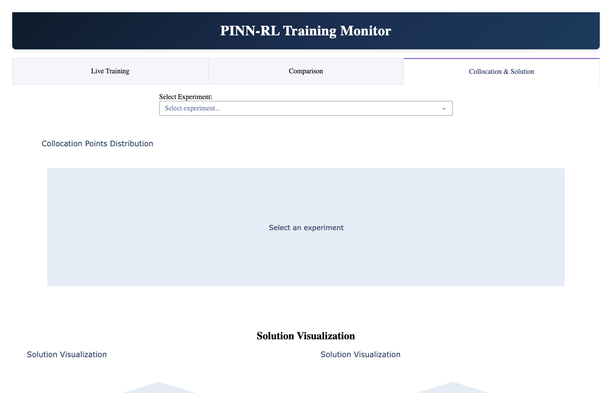

# Dashboard Guide

The pinnrl dashboard is a browser-based interface for configuring, launching, and monitoring PINN training experiments. It replaces the need for manual CLI invocations and plotting scripts.

## Launching the dashboard

```bash
python src/main.py
```

Open [http://127.0.0.1:8050/](http://127.0.0.1:8050/) in your browser.

---

## Layout overview

The dashboard is organized into three tabs:

| Tab | Purpose |
|-----|---------|
| **Live Training** | Launch new experiments and monitor running/completed ones |
| **Comparison** | Compare architectures and PDEs side by side |
| **Collocation & Solution** | Visualize collocation point distributions and solution surfaces |

---

## Live Training

The Live Training tab has two sub-tabs: **Monitor** and **New Training**.

### Monitor

Select any experiment from the dropdown to see its training progress, loss curve, and current status.



The monitor displays:

- **Experiment selector** — dropdown listing all experiments in the `experiments/` directory
- **Progress bar** — shows epoch progress for running experiments
- **Loss graph** — total loss, residual loss, boundary loss, and initial condition loss over epochs

Experiments are auto-detected from the `experiments/` directory. Running experiments show a `.running` indicator and refresh automatically.

### New Training

Configure and launch a new training run directly from the browser.



**Model Configuration** (left column):

- **PDE** — select from 9 supported PDEs. Changing the PDE auto-selects the recommended architecture.
- **Architecture** — choose from 6 neural architectures (feedforward, resnet, siren, fourier, attention, autoencoder).
- **Device** — CPU, MPS (Apple Silicon), or CUDA.
- **RL Adaptive Sampling** — toggle to enable the DQN-based collocation agent.

**Hyperparameters** (right column):

- **Epochs** — number of training epochs (default: 3000)
- **Learning Rate** — optimizer learning rate (default: 0.005)
- **Batch Size** — training batch size (default: 2048)
- **Collocation Points** — interior sampling points (default: 5000)
- **Boundary Points** — boundary condition points (default: 500)
- **Initial Points** — initial condition points (default: 500)

Click **Start Training** to launch. Training runs as a background process — you can close the browser and results are saved automatically to a timestamped directory under `experiments/`.

---

## Comparison

Compare training results across architectures or PDEs.



Select completed experiments to overlay their loss curves and accuracy metrics. This is useful for:

- Benchmarking architectures on the same PDE
- Comparing convergence rates across different hyperparameter choices
- Identifying which architecture best suits a particular equation type

---

## Collocation & Solution

Visualize the trained solution surface and collocation point distribution for any completed experiment.



- **Solution surface** — 3D plot of the predicted `u(x, t)` field
- **Exact solution overlay** — compare against the analytical solution
- **Collocation points** — scatter plot showing where training points were sampled
- **Time slider** — scrub through time to see solution evolution

This tab loads the saved model checkpoint and reconstructs the solution on a dense grid for visualization.

---

## Experiment directory structure

Each training run creates a directory under `experiments/`:

```
experiments/
  20260310_143000_Heat Equation_fourier_no_rl/
    config.yaml          # full config snapshot
    metadata.json        # status, timing, PDE, architecture
    final_model.pt       # trained model weights
    loss_curve.png       # training loss plot
    solution_plot.png    # predicted vs exact solution
    metrics.json         # L2 error, max error, mean error
    visualizations/      # additional plots
```

While training is in progress, a `.running` marker file is present. It is removed when training completes or fails.

---

## Tips

- **Start simple**: Use the Heat Equation with Fourier Features and 3000 epochs for your first run. It converges reliably and lets you verify the setup works.
- **Architecture recommendations**: The PDE dropdown auto-selects a recommended architecture. These defaults come from extensive benchmarking and are a good starting point.
- **RL sampling**: Enable RL adaptive sampling for nonlinear PDEs with sharp gradients (Burgers, Allen-Cahn). For smooth problems (Heat, Wave), uniform sampling is sufficient.
- **Monitor convergence**: If the loss plateaus early, try increasing collocation points or switching architectures before increasing epochs.
