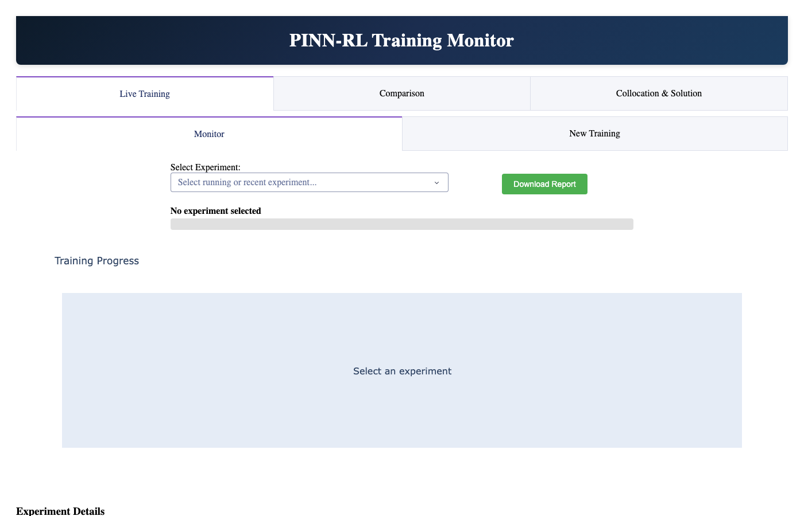
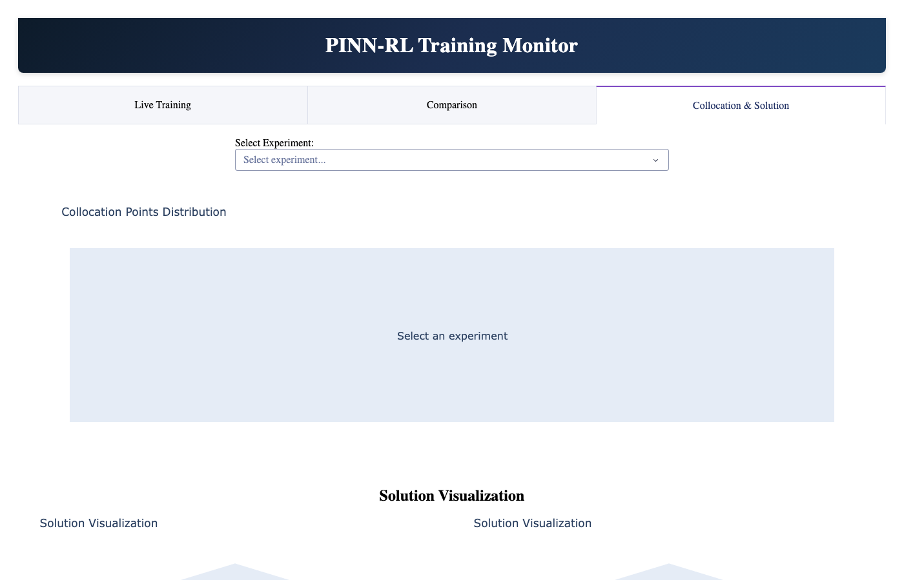
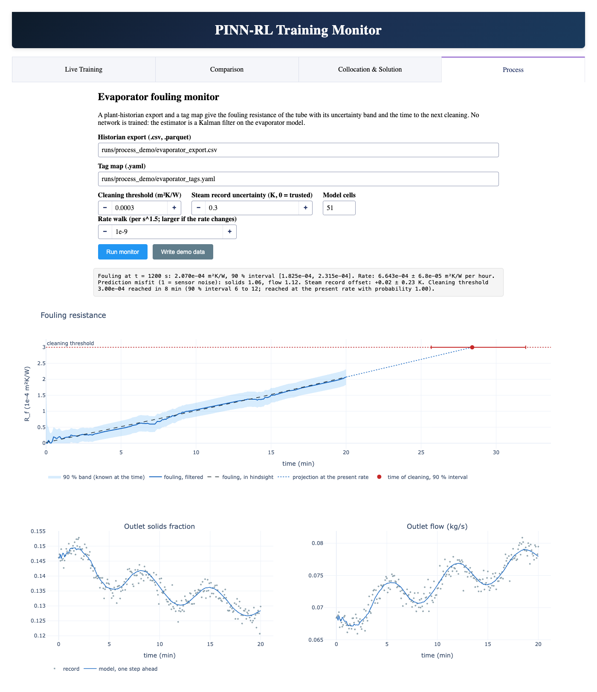

# Dashboard

This page describes the browser app that launches runs, follows them as they train and compares their results. It also runs the fouling monitor on plant data.

```bash
pinnrl-dashboard                       # http://127.0.0.1:8050/, opens a browser tab
pinnrl-dashboard --port 8051 --no-browser
```

- **Runs folder**: `./runs/`, relative to the directory you start the dashboard from. It is the folder `pinnrl-train` uses.
- **Launched runs**: ordinary `pinnrl-train` processes. They keep going if you close the browser.
- **Port**: if the port is taken, the next two are tried.



## Live Training

**New Training** is a form over every `pinnrl-train` option: the PDE, architecture, budget, sampling strategy, optimizer, LR schedule, adaptive weights, loss function and mode. Defaults come from `config.yaml` for the selected PDE.

- **Sampling strategy**: the rule that places the collocation points, where the equation's residual is evaluated. The RL bandit is an experimental one.
- **Inverse mode**: training that also identifies parameters of the equation. The form asks for the parameters, their initial guesses, and the observation source: synthetic noisy samples of the exact solution, or an `.npz` file.
- **Well dataset**: a simulation dataset of [The Well](datasets.md). Choosing one fills in its recommended mode and architecture.


**Monitor** follows a run as it trains. It shows:

- the loss components and the learning rate;
- the parameter trajectory in inverse mode, against the true value when known;
- interactive 3-D surfaces of the predicted `u(x, t)` and the PDE residual.

The surfaces are read from the run's `live_snapshot.npz`, written every `validation_frequency` epochs plus at the start and the end. 2-D PDEs are shown as a time slice.

## Collocation & Solution

For a finished run, this tab shows:

- the predicted and exact solution surfaces, with a time slider (the exact panel is empty for PDEs without a closed form);
- the point-wise error;
- where the collocation points were placed over training, which is how you check what an adaptive sampler did.



## Process

This tab is the soft sensor of the evaporator twin on plant data. It runs the [fouling monitor](process_twins.md#estimating-a-drifting-parameter). No network is trained, so the result is there in a few seconds.

- **Soft sensor**: an estimate of a quantity the plant does not measure, computed from the sensors it has.
- **Fouling resistance**: the extra resistance to heat transfer of the deposit on the tube.
- **Fouling monitor**: a Kalman filter on the evaporator model, with the fouling resistance as a level and a rate.
- **Historian export**: the plant's recorded sensor data, as CSV or Parquet.
- **Tag map**: a YAML file that says which column of the export is which signal ([format](process_twins.md#plant-data-a-historian-export-and-a-tag-map)). A `model:` block in it overrides the tube's parameters (`length`, `U`, `velocity`, ...).

Give the historian export and the tag map. The view shows:

| Output | Content |
|---|---|
| Fouling resistance | The estimate at each record with its 90 % band (what was known at the time), the hindsight estimate from the whole record, the cleaning threshold, and the projected time of reaching it with its interval |
| Outlet records | The records against the filter's one-step predictions |
| Prediction misfit (in the summary) | In units of the sensor noise. Near 1 when the model explains the records; a larger value says the band should not be trusted |

- **Open interval**: a time to clean whose upper end is open means the fouling rate is not yet clearly positive.
- **Steam record uncertainty**: a steam-temperature offset mimics fouling (0.5 K for 30 %, experiment J04). Enter how well the steam record is trusted and the offset is estimated alongside. This widens the band to what the data support ([J06](benchmarks.md#calibrated-fouling-intervals-experiment-j06)).
- **Rate walk $q$**: how fast the fouling rate $r$ may change, with $\tau$ the time over which it may change by its own size:

$$
q = \frac{r}{\sqrt{\tau}}
$$

- The default suits a steady drift. On a curve that bends it gives a narrow band around a biased estimate.
- A larger value is the safe choice, at the price of a wider time to clean.
- **Write demo data** puts a synthetic 20-minute export and its tag map in `runs/process_demo/` and fills the form. The two files are a template for a real export.



## Comparison

Select several finished runs to overlay their loss curves and compare final metrics side by side.


- **Delete**: runs can be deleted from the selector, with a confirmation step. Only folders inside the runs directory can be removed.
- **Load in Python**: use `pinnrl.training.train.load_run` (see [Training](training.md#python)).
